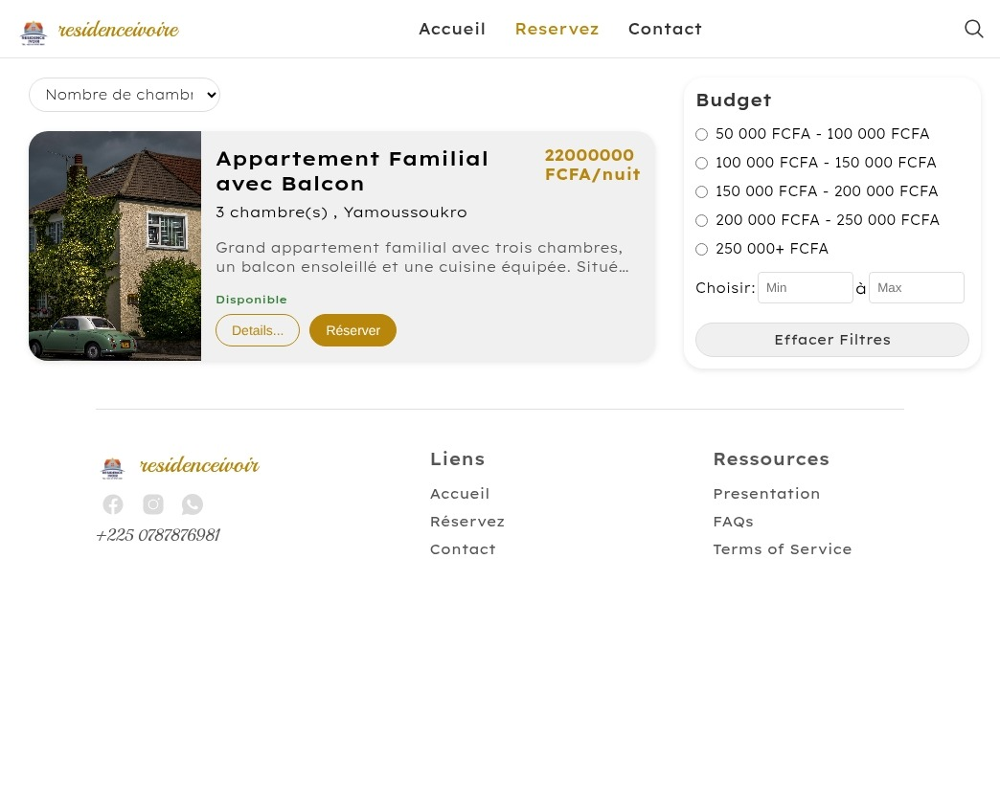

# Residence Ivoir

Residence Ivoir is a showcase project for a fictional real estate rental service in Ivory Coast. It's built with Django and is designed to be easily deployed to Heroku.

## Screenshots

### Homepage


### Residences Screen


## Features

*   Browse available residences
*   View residence details and pricing
*   Contact form for inquiries
*   Admin interface for managing residences

## Getting Started

These instructions will get you a copy of the project up and running on your local machine for development and testing purposes.

### Prerequisites

*   Python 3.10 or higher
*   Pip
*   Virtualenv (recommended)

### Installation

1.  **Clone the repository:**

    ```bash
    git clone https://github.com/your-username/residence-ivoir.git
    cd residence-ivoir
    ```

2.  **Create and activate a virtual environment:**

    ```bash
    python -m venv venv
    source venv/bin/activate  # On Windows, use `venv\Scripts\activate`
    ```

3.  **Install the dependencies:**

    ```bash
    pip install -r requirements.txt
    ```

4.  **Apply the database migrations:**

    ```bash
    python manage.py migrate
    ```

5.  **Create a superuser to access the admin panel:**

    ```bash
    python manage.py createsuperuser
    ```

6.  **Run the development server:**

    ```bash
    python manage.py runserver
    ```

The application will be available at `http://127.0.0.1:8000/`.

## Configuration

The project uses environment variables for configuration. You can set them in a `.env` file in the project root.

*   `SECRET_KEY`: Django's secret key. A default is provided for development, but you should generate a new one for production.
*   `DEBUG`: Set to `True` for development, `False` for production.
*   `DATABASE_URL`: The URL of your database. Defaults to a local SQLite database.
*   `CLOUDINARY_URL`: The URL for your Cloudinary account, if you are using it to host the media files.

### Example `.env` file

```
SECRET_KEY=your-secret-key
DEBUG=True
```

## Deployment

This project is configured for deployment to Heroku.

1.  **Create a Heroku account and install the Heroku CLI.**

2.  **Create a new Heroku app:**

    ```bash
    heroku create your-app-name
    ```

3.  **Add a PostgreSQL database:**

    ```bash
    heroku addons:create heroku-postgresql:hobby-dev
    ```

4.  **Set the environment variables in Heroku:**

    ```bash
    heroku config:set SECRET_KEY=$(python -c 'from django.core.management.utils import get_random_secret_key; print(get_random_secret_key())')
    heroku config:set DEBUG=False
    ```

5.  **Push the code to Heroku:**

    ```bash
    git push heroku main
    ```

6.  **Apply the database migrations on Heroku:**

    ```bash
    heroku run python manage.py migrate
    ```

## Running Tests

To run the test suite, execute the following command:

```bash
python manage.py test
```
